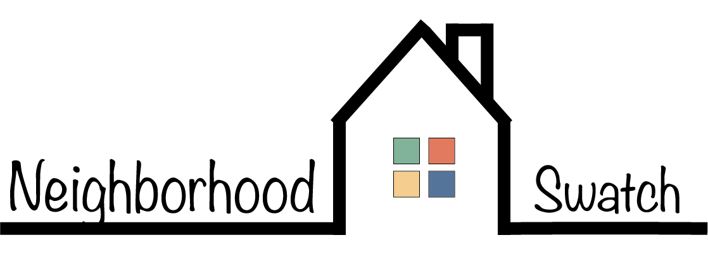

## **Overview**
Neighborhood Swatch is an application designed for home buyers who are looking to relocate to Atlanta, Georgia. Purchasing a home is a huge undertaking and the process can become overwhelming when also relocating to a new city. Neighborhood Swatch was created to give users a place to start their search by matching their income with three suggested neighborhoods. After populating data for three matches, the user is provided with resources that explain the home buying process. Links are also available for each zip code where the user can browse homes in each area on Realtor.com. 

## **Technologies Used**
* HTML/CSS
* Javascript 
* Bootstrap
* JQuery
* Firebase 
* APIs: 
    * U.S. Cencus 
    * Realtor.com 

## **Running the project**
* Users sign in through Google so will need a gmail account.
* App will be hosted after 1/4/21 and the link will be provided here. 

## **Team**

- Ally Deeter - managed APIs and javascript logic
- Adam MacKinnon - controlled log-in functionality and data storage
- Andrea Myers - directed sign design and page layouts 

